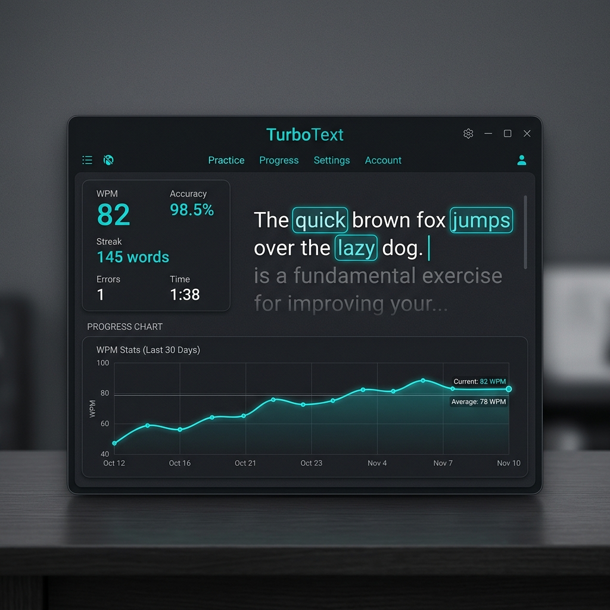

# ⚡ TurboText

TurboText is a high-performance, minimalist typing application built for speed and precision. Inspired by the sleek aesthetics of Monkeytype, it offers a premium typing experience with real-time analytics, dynamic themes, and a focus on distraction-free performance.



## ✨ Features

- **🎯 Minimalist UX**: A clean, distraction-free environment designed to help you reach your peak WPM.
- **📊 Advanced Analytics**: High-fidelity performance charts powered by `recharts`, tracking WPM and Raw WPM second-by-second.
- **🎨 Dynamic Themes**: Switch between multiple premium themes like Carbon, Nord, Deep, and Lavender instantly.
- **⚙️ Strict Accuracy**: Competitive accuracy tracking that accounts for corrected mistakes—measuring your true typing precision.
- **♾️ Infinite Stream**: Never run out of words. The app generates a continuous stream of text as you type.
- **📜 3-Line Viewport**: A fixed-height, auto-scrolling viewport that keeps your current line centered and stable.
- **🔊 Mechanical Sounds**: Immersive auditory feedback using the Web Audio API for a tactile typing feel.
- **📸 Result Export**: Export your performance stats as high-quality PNG images with one click.
- **⚡ Global Focus**: Start typing anywhere, anytime. The app intelligently grabs focus so you never miss a keystroke.

## 🚀 Tech Stack

- **Frontend**: React.js
- **Styling**: Tailwind CSS
- **Animations**: Framer Motion
- **Data Viz**: Recharts
- **Icons**: React Icons
- **Utility**: html-to-image, faker-js

## 🛠️ Installation

1. Clone the repository:
   ```bash
   git clone https://github.com/mozix5/turboText.git
   ```

2. Install dependencies:
   ```bash
   npm install
   ```

3. Start the development server:
   ```bash
   npm run dev
   ```

## ⌨️ Shortcuts

- `tab` — Quick restart the test.
- `ctrl/meta + backspace` — Delete word by word.
- `any key` — Automatically focuses and starts the test.

## 🤝 Contributing

Contributions, issues, and feature requests are welcome! Feel free to check the [issues page](https://github.com/mozix5/turboText/issues).

## 📄 License

Distributed under the MIT License. See `LICENSE` for more information.

---
Built with ❤️ by [mozix](https://recap-after-use.vercel.app/)
